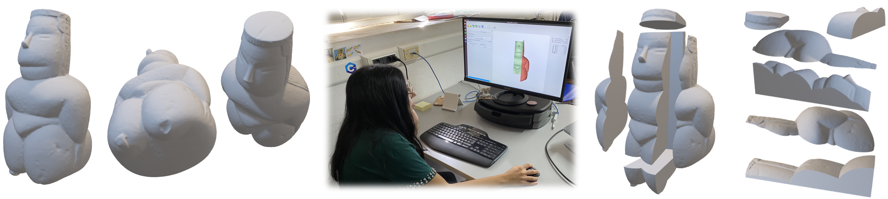

# Split And Mill: user assisted height-field block decomposition for fabrication

[Alessandro Muntoni](http://vcg.isti.cnr.it/~muntoni/), [Lucio Davide Spano](http://people.unica.it/davidespano/), [Riccardo Scateni](http://people.unica.it/riccardoscateni/)<br/>
*Smart Tools and Applications in Graphics (2019)*<br/>



[](https://www.youtube.com/watch?v=f3_Ffuv6u2U)

## Abstract

We present here Split and Mill: an interactive system for the manual volume decomposition of free form shapes.
Our primary purpose is to generate portions respecting the properties allowing to mill them with a 3-axis milling machine.
We show that a manual decomposition is competitive with the automatic partitioning when the user is skilled enough.
We, thus, think that our tool can be beneficial for the practitioners in the field, and we release it as free software.

\[[Paper]()\]
\[[Web Site]()\]


## Source Code
Source code is hosted on this GitHub repository. The program is built and tested on Ubuntu 18.04 with GCC 7.3 and on Microsoft Windows 10 with MSVC2017.

## Download
```bash
git clone --recursive https://github.com/cg3hci/SplitAndMill
```
## Build and Run 

### Ubuntu 18.04
```bash
sudo apt-get install qt5-default
sudo apt-get install libboost-all-dev libcgal-dev libgmp-dev libqglviewer-dev-qt5 libeigen3-dev
qmake SplitAndMill.pro
make
```
### Windows

\[[Windows Binaries](bin/SplitAndMill_windows_dep.zip)\]

Download [Qt](https://www.qt.io/download-qt-installer?hsCtaTracking=99d9dd4f-5681-48d2-b096-470725510d34%7C074ddad0-fdef-4e53-8aa8-5e8a876d6ab4) and install it.

Download [Eigen](http://eigen.tuxfamily.org/index.php?title=Main_Page) library and create an environment variable called EIGEN_PATH containing the path in which the library is placed.

Download and install [CGAL](https://www.cgal.org/) library and create an environment variable called CGAL_PATH containing the path in which the library is installed.

Download and install [libQGLViewer](http://libqglviewer.com/) library and create an environment variable called LIBQGLVIEWER_PATH containing the path in which the library is installed.

Clone this repo:
```bash
git clone --recursive https://github.com/cg3hci/SplitAndMill
```

Open the SplitAndMill project with QtCreator and run it.

## Code, warranties and bug report
For any info about the software, please contact Alessandro Muntoni (muntoni.alessandro@gmail.com).
The software is provided without warranty of any kind. 
In case of bugs please report them [here](https://github.com/cg3hci/SplitAndMill/issues).

## License
[GPL3](https://www.gnu.org/licenses/gpl-3.0.html) licensed
